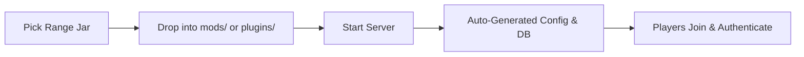
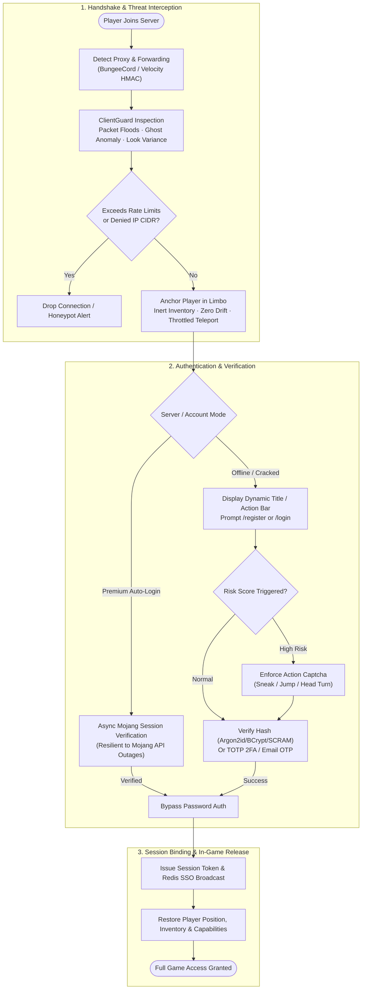

<!-- markdownlint-disable -->
<div align="center">


[](https://github.com/PotenFYR-Studios/AuthCore)

<p align="center">
  <a href="https://potenfyr.in"></a>
  <a href="https://authcore.potenfyr.in"></a>
  <a href="https://discord.com/invite/zUaN2FPBec"></a>
  <a href="https://modrinth.com/mod/authCore"></a>
  <a href="mailto:support@potenfyr.in"></a>
  <a href="https://github.com/PotenFYR-Studios/AuthCore"></a>
</p>

[](https://github.com/PotenFYR-Studios/AuthCore/actions/workflows/ci.yml)
[](https://github.com/PotenFYR-Studios/AuthCore/actions/workflows/snapshot-compat.yml)
[](https://github.com/PotenFYR-Studios/AuthCore#-which-jar-do-i-need)
[](https://github.com/PotenFYR-Studios/AuthCore#-multi-version--multi-loader-compatibility)
[](https://github.com/PotenFYR-Studios/AuthCore#-building-from-source)
[](https://github.com/PotenFYR-Studios/AuthCore#-security-testing)
[](LICENSE)

<p align="center">
  <b>The Fortress Framework for Minecraft Servers. One unified codebase for 1.16.0 → 26.x+ on Fabric, Forge, and NeoForge.</b><br>
  Hardened against every attack scenario, race-condition-free under burst load, and engineered to hold <b>500k+ registered accounts</b> and thousands of concurrent players with flat, spike-free resource usage.
</p>

<p align="center">
  <a href="#-quick-start-in-5-minutes">Quick Start</a> •
  <a href="#-highlights--core-philosophy">Highlights</a> •
  <a href="#-which-jar-do-i-need">Jar Matrix</a> •
  <a href="#-architecture--authentication-lifecycle">Architecture</a> •
  <a href="#%EF%B8%8F-commands">Commands</a> •
  <a href="#%EF%B8%8F-configuration">Configuration</a> •
  <a href="#%EF%B8%8F-detection-bypass-resistance">Security Model</a> •
  <a href="#-activity-star-history--metrics">Live Metrics</a> •
  <a href="#-community--contributing">Community</a>
</p>

---

</div>

## 📑 Contents

<details open>
<summary><b>Click to expand / collapse contents</b></summary>

- [✨ Highlights & Core Philosophy](#-highlights--core-philosophy)
- [🚀 Quick Start in 5 Minutes](#-quick-start-in-5-minutes)
- [📦 Which Jar Do I Need?](#-which-jar-do-i-need)
- [🧩 Architecture & Authentication Lifecycle](#-architecture--authentication-lifecycle)
- [🛡️ 7-Layer Detection Bypass Resistance](#%EF%B8%8F-detection-bypass-resistance)
- [🛠️ Commands Reference](#%EF%B8%8F-commands)
  - [Player Commands](#player-commands)
  - [Admin Commands](#admin-commands)
- [⚙️ Split Configuration Architecture](#%EF%B8%8F-configuration)
- [🚦 Complete Feature Setup Matrix](#-feature-setup-at-a-glance)
- [🌍 Multi-Language Localization](#-languages)
- [🔁 Proxy & Network Integration (Velocity / BungeeCord)](#-proxy--network-velocity--bungeecord)
- [⚡ Performance & Resource Tuning](#-performance)
  - [Low-Resource Hardware Guidelines (≤ 250 MB RAM / 1 Core)](#-low-resource-servers--250-mb-ram--1-core)
- [🔮 Multi-Version & Multi-Loader Compatibility](#-multi-version--multi-loader-compatibility)
- [🧑‍💻 Building From Source](#-building-from-source)
- [🧪 Security Testing](#-security-testing)
- [🐳 Docker Verification (Host Tests)](#-docker-verification-host-tests)
- [📚 Comprehensive Documentation Portal](#-documentation)
- [❓ Frequently Asked Questions (FAQ)](#-faq)
- [🗺️ Roadmap & Shipped Milestones](#%EF%B8%8F-roadmap)
- [📈 Activity, Star History & Metrics](#-activity-star-history--metrics)
- [🤝 Community & Contributing](#-community--contributing)
- [📜 License](#-license)

</details>

---

## ✨ Highlights & Core Philosophy

<table>
  <tr>
    <td width="50%">
      <h3>🏰 Single Universal Codebase</h3>
      <p>One unified codebase spanning <b>Minecraft 1.16.0 → 26.x+ and snapshots</b> across <b>Fabric, Forge, NeoForge</b>, and <b>Velocity/BungeeCord</b>. Each range jar serves dual roles: server mod and proxy plugin with zero porting overhead.</p>
    </td>
    <td width="50%">
      <h3>🔒 Defense-in-Depth & Zero-Leak</h3>
      <p>7-layer detection bypass defense, Argon2id/BCrypt/SCRAM password hashing, risk-based physical action captcha, brute-force lockouts, honeypots, and token-authenticated HTTPS REST web admin panel.</p>
    </td>
  </tr>
  <tr>
    <td width="50%">
      <h3>⚡ 500k+ Scale & Zero Resource Spikes</h3>
      <p>O(1) UUID-keyed lockless lookups, bounded LRU caches, lazy database fetching, atomic sequence gates, and throttled anchor teleports guarantee flat, spike-free memory and CPU curves under burst join storms.</p>
    </td>
    <td width="50%">
      <h3>🛡️ Outage-Proof Hybrid Auth</h3>
      <p>Automatic server mode detection from <code>server.properties</code>. Background-retrying Mojang verification allows verified premium players to bypass passwords while offline/cracked players join and authenticate seamlessly.</p>
    </td>
  </tr>
</table>

---

## 🚀 Quick Start in 5 Minutes



1. **Pick the Right Jar**: Select the jar matching your server loader and Minecraft version from the [Jar Matrix](#-which-jar-do-i-need) via [Modrinth](https://modrinth.com/mod/authCore) or [GitHub Releases](https://github.com/PotenFYR-Studios/AuthCore/releases).
2. **Install**: Drop the jar file directly into your server's `mods/` directory (or your proxy's `plugins/` directory).
3. **Start the Server**: AuthCore boots out of the box with zero required configuration. An embedded SQLite database (`authcore.db`) is automatically provisioned in `config/authcore/`.
4. **First Join Experience**:
   - **Premium Players**: Verified asynchronously against Mojang session servers with background retry resilience. Auto-logged in without requiring passwords.
   - **Cracked / Offline Players**: Anchored inside the secure limbo lobby, prompted with interactive chat buttons or commands: `/register <password> <confirm>` or `/login <password>`.
5. **Administer**: Run `/authcore validate` to dry-run configuration integrity or check the interactive web panel at `https://127.0.0.1:25570`.

```text
┌─────────────────────────────────────────────────────────────┐
│  ✓  AUTHCORE v1.0.0 — FORTRESS FRAMEWORK INITIALIZED       │
├─────────────────────────────────────────────────────────────┤
│  Platform         : Fabric / Forge / NeoForge / Velocity   │
│  Minecraft        : 1.16.0 → 26.x+ (Universal Range Engine) │
│  Database         : SQLite (WAL) / MySQL / PostgreSQL       │
│  Security Stack   : 7-Layer Detection Bypass Resistance     │
│  Crypto           : Argon2id (M:64MB, T:3, P:1) + SCRAM     │
│  Proxy Forwarding : Auto-Detected (Velocity HMAC / Bungee)  │
│  Web Panel        : https://127.0.0.1:25570 (Token Guarded) │
│  Status           : 0 Warnings · 180+ Security Audits PASS  │
└─────────────────────────────────────────────────────────────┘
```

> [!NOTE]
> New to AuthCore? Check out the full [Server Admin Guide](https://authcore.potenfyr.in/docs/1.0.0/guide.html) for visual step-by-step walkthroughs, permission setups, and proxy topologies.

---

## 📦 Which Jar Do I Need?

Each compiled jar performs **both roles**: a native server mod (Fabric, Forge, or NeoForge) and a BungeeCord/Velocity proxy plugin (automatically detected upon startup). Select the jar corresponding to your Minecraft version range and loader:

| Jar Artifact | Minecraft Versions | Loader | Target Java | Era & Architecture |
|:---|:---|:---:|:---:|:---|
| `authcore-1.16-1.18-fabric-<v>.jar` | **1.16.0 – 1.18.2** | Fabric | 17 | Intermediary mappings era |
| `authcore-1.16-1.18-forge-<v>.jar` | **1.16.0 – 1.18.2** | Forge | 17 | Intermediary mappings era |
| `authcore-1.19-1.21-fabric-<v>.jar` | **1.19.0 – 1.21.11** | Fabric | 21 | Intermediary mappings era |
| `authcore-1.19-1.21-neoforge-<v>.jar` | **1.19.0 – 1.21.11** | NeoForge | 21 | Intermediary mappings era |
| `authcore-26.1-26.2-fabric-<v>.jar` | **26.1 – 26.2+ & Snapshots** | Fabric | 25 | Unobfuscated era (Official Mojang names, forward-compatible) |
| `authcore-26.1-26.2-neoforge-<v>.jar` | **26.1 – 26.2+ & Snapshots** | NeoForge | 25 | Unobfuscated era (Official Mojang names, forward-compatible) |

> [!TIP]
> **Why range jars?** Minecraft 26.0+ ships completely **unobfuscated code** and Fabric intermediary is deprecated for 26.x onwards (see [Fabric announcement](https://fabricmc.net/2025/10/31/obfuscation.html)). Each range jar is thoroughly verified across every endpoint in its version bracket using our parallel Docker test harness.

---

## 🧩 Architecture & Authentication Lifecycle



---

## 🛡️ Detection Bypass Resistance

AuthCore deploys a **7-layer defense-in-depth security stack** designed to make automated client bypasses, bot farm attacks, and credential stuffing attacks mathematically and practically infeasible:

| Layer | Mechanism | Threat Vectors Mitigated |
|:---:|:---|:---|
| **1. Session Binding** | Per-server random 32-byte companion attestation key rotated on reload | Companion spoofing, replay attacks, session token theft |
| **2. Packet Sequence Validation** | Strict `HELLO` → `SETTINGS` → `READY` login state machine | Headless clients skipping initialization packets, out-of-order exploits |
| **3. Behavioral Profiling** | ClientGuard risk engine: client brand anomalies, ghost clients, tab probing | Macro injection, automated scanners, packet flooders |
| **4. Look-Pattern Analysis** | Camera rotation delta variance (coefficient of variation profiling) | Bots with frozen pitch/yaw or robotic linear camera movement |
| **5. Login Timing Distribution** | IP-level login timestamp CV analysis (60s rolling window, ≥3 samples) | Synchronized botnets, scripted credential stuffing bursts |
| **6. Farm Fingerprinting** | Detection of ≥3 distinct usernames connecting from identical IP within 5s | Distributed proxy rotators, mass alt farm coordination |
| **7. Login Intelligence** | Device fingerprints, GeoIP country alerts, and strict 2FA attempt limits (5/min/IP) | Account takeovers, credential reuse, brute-force attacks |

### Architectural Security Guarantees
- **Fail-Closed Defaults**: Proxy authentication mandates Redis synchronization; an empty `trusted-proxies` list automatically turns off insecure proxy ingestion.
- **Cryptographic Independence**: No hardcoded keys exist in the binary; attestation secrets are dynamically generated with high-entropy CSPRNG on first boot.
- **State Integrity & Memory Protection**: All detection and IP tracking maps have enforced cardinality bounds and auto-cleanse on tick to thwart memory-exhaustion attacks.
- **No Single Point of Failure**: Each defense layer executes independently; even if an attacker bypasses client branding checks, packet timing and behavioral analysis remain active.

---

## 🛠️ Commands

### Player Commands

| Command | Syntax & Usage | Purpose |
|:---|:---|:---|
| `/register` | `/register <password> [<confirm>] [<2fa>]` | Create and bind a new player account with password rules enforcement |
| `/login` | `/login <password> [<2fa>]` | Authenticate the account and exit the limbo lobby |
| `/account` | `/account logout` · `set-password <new>` · `codes` | Manage active sessions, update password, or generate one-time recovery codes |
| `/account` | `/account email <address>` · `nickname <name>` | Configure password recovery email or set localized display nickname |
| `/account` | `/account set-mode online\|offline` | Toggle player's authentication mode between automatic Mojang login and password login |
| `/account` | `/account recover <email> [<code> <new-password>]` | Self-service password recovery via one-time SMTP email verification |
| `/account` | `/account unregister` | Permanently wipe account credentials (subject to server policies) |
| `/discord` | `/discord link` · `/discord unlink` | Generate Discord account link code to synchronize with DiscordSRV or panel |

### Admin Commands

> Access requires Minecraft OP level 3+, LuckPerms permission node, or server console execution.

| Command | Syntax & Usage | Purpose |
|:---|:---|:---|
| `/authcore reload` | `/authcore reload` | Hot-reload all split configuration blocks and locale files |
| `/authcore validate` | `/authcore validate` | Perform dry-run validation of configuration files and database connections |
| `/authcore compat` | `/authcore compat` | Generate system report: loader environment, config versions, DiscordSRV/InteractiveChat status |
| `/authcore import` | `/authcore import authme <file>` | Import legacy AuthMe SQLite database (non-destructive; legacy hashes auto-upgrade on login) |
| `/authcore whois` | `/authcore whois <player>` | Inspect detailed account state: UUID, registration date, IP, 2FA status, last mode |
| `/authcore history` | `/authcore history <player>` | Inspect player's recent 10 login attempts with calculated risk scores and GeoIP data |
| `/authcore list` | `/authcore list players` · `list online/offline-players` | Query database-backed player accounts with filtering |
| `/authcore destroy-session` | `/authcore destroy-session <player>` | Invalidate an active session across all network instances and kick the player |
| `/authcore set-password` | `/authcore set-password <player> <new>` *(alias: `resetpw`)* | Administratively reset a player's password |
| `/authcore set-mode` | `/authcore set-mode online\|offline <player>` | Override an account's authentication mode |
| `/authcore delete` | `/authcore delete player <player>` | Delete an account and purge records from the database |
| `/authcore set-spawn` | `/authcore set-spawn limbo <x> <y> <z>` | Set exact world coordinates for the unauthenticated limbo lobby |
| `/authcore backup` | `/authcore backup` · `export` | Trigger immediate database snapshot backup or export full JSON dump |
| `/authcore maintenance` | `/authcore maintenance on\|off` | Toggle maintenance mode to restrict server access to administrators |

---

## ⚙️ Configuration

AuthCore generates all configuration files inside `config/authcore/`. The architecture utilizes **one file per configuration domain**, guaranteeing clean version control diffs and zero credential leakage into gameplay configs:

| Configuration File | Domain Scope | Primary Settings |
|:---|:---|:---|
| `settings.conf` | Root Settings | `language`, `debugMode`, `logging`, `cache-max-users`, schema `version` |
| `session.conf` | Session & Security | Session TTLs, account locking, SSO, web panel, SMTP email, ClientGuard |
| `lobby.conf` | Limbo Lobby & Captcha | Limbo restrictions, timeouts, action captcha tuning, anti-vibration intervals |
| `password-rules.conf` | Password Rules | Minimum length, required character classes, hashing algorithm (Argon2id/BCrypt) |
| `commands.conf` | Command Permissions | Command LuckPerms permission nodes, aliases, and OP level overrides |
| `database.conf` | Database Storage | SQLite, MySQL, PostgreSQL, and Redis connection strings & pool sizing |
| `messages-<lang>.conf` | Localization | UI messages, titles, action bars, chat text (e.g. `messages-en.conf`) |

### Example Configuration Snippet

```hocon
# settings.conf
language = "en"              # en | zh | es | de | fr | pt | ru
cache-max-users = 20000      # Bounded LRU cache size

# session.conf
session {
    # Server online/offline mode is automatically detected from server.properties!
    timeout-ms = 3600000     # Active session validity (60 minutes)

    account-lock {
        enabled = true
        max-failed-logins = 8
        lock-duration-ms = 600000
    }

    security {
        webhook-url = "https://discord.com/api/webhooks/..." # Discord security alerts
    }

    proxy-support {
        enabled = false       # Enable when placed behind Velocity or BungeeCord
        protocol = "auto"     # Supports "auto", "velocity", "bungeecord"
    }

    web-panel {
        enabled = false       # REST administration dashboard
        host = "127.0.0.1"
        port = 25570
        token = "CHANGE_ME"   # Generate via: openssl rand -hex 16
    }

    email {
        enabled = false       # SMTP recovery codes and login alerts
        host = "smtp.gmail.com"
        port = 587
        username = "admin@example.com"
        password = "app-password"
        from = "AuthCore Security <admin@example.com>"
    }
}

# lobby.conf
lobby {
    movement-correction-radius = 1.5      # Distance before non-jittery snap-back
    movement-correction-interval-ms = 600 # Minimum time between position corrections
}
```

---

## 🚦 Feature Setup at a Glance

All features in AuthCore are **modular and optional**. Zero setup is required for basic SQLite usage. Activate only what your network demands:

| Feature | Configuration Block | Rationale & Protection | Quick Setup Command / Key |
|:---|:---|:---|:---|
| **Human Action Captcha** | `lobby.captcha` | Eliminates 99% of login bots by assigning physical tasks (sneak/jump/look) to suspicious joins | `lobby { captcha { enabled = true } }` |
| **2FA / MFA (TOTP & Email)** | `session.authentication` | Shields high-value staff and player accounts from stolen/leaked passwords | `session { authentication { allow-totp-support = true } }` |
| **Account Lock & Brute-Force** | `session.account-lock` | Halts dictionary attacks by temporarily locking accounts after repeated bad passwords | `session { account-lock { enabled = true } }` |
| **Persistent Sessions** | `session.enable-sessions` | Enhances player UX by remembering verified logins on reconnect from the same IP | `session { enable-sessions = true }` |
| **ClientGuard Risk Engine** | `session.client-guard` | Detects macro injection, ghost clients, and packet floods using 0-100 risk scores | `session { client-guard { enabled = true } }` |
| **AuthIntelligence** | `session.auth-intelligence` | Identifies credential stuffing bursts, multi-account bot farms, and IP rotation | `session { auth-intelligence { ... } }` |
| **Network Rate Limits** | `session.rate-limit` | Absorbs connection and login floods per IP address without crashing the main thread | `session { rate-limit { enabled = true } }` |
| **CIDR IP Rules** | `ip-rules.conf` | Explicitly whitelist or blacklist IP addresses, VPN ranges, or ASN networks | `deny = ["45.155.0.0/16"]` |
| **Network-Wide SSO** | `session.sso` + Redis | Single sign-on across multi-server proxy networks; authenticate once, play anywhere | `database { redis { enabled = true } }` + `sso { enabled = true }` |
| **Web Administration Panel** | `session.web-panel` | Secure token-authenticated browser interface and REST API for remote management | `session { web-panel { enabled = true; token = "..." } }` |
| **Honeypot Scanner Trap** | `session.honeypot` | Listens on a dummy port, automatically trapping and blocking malicious network scanners | `session { honeypot { enabled = true; port = 25571 } }` |
| **Hybrid Auto-Login** | `session.authentication` | Automatically logs in verified Mojang accounts while seamlessly allowing cracked clients | `session { authentication { premium-auto-login = true } }` |
| **Proxy Forwarding** | `session.proxy-support` | Unpacks real client IPs and UUIDs from BungeeCord or modern Velocity HMAC handshakes | `session { proxy-support { enabled = true; protocol = "auto" } }` |
| **Maintenance Mode** | `session.maintenance` | Restricts player access to administrators during database upgrades or server updates | `/authcore maintenance on` |
| **Automatic Whitelist** | `session.auto-whitelist` | Automatically whitelists players on the native vanilla whitelist once registered | `session { auto-whitelist { enabled = true } }` |
| **Shadow-Ban** | `session.shadow-ban` | Silently isolates malicious actors without alerting them to detection | `session { shadow-ban { enabled = true } }` |
| **Automated Backups** | `session.backup` | Periodically captures atomic backups of user credentials and database tables | `session { backup { interval-hours = 24; keep = 10 } }` |
| **Discord Linking** | `session.discord-link` | Associates Minecraft profiles with Discord IDs for community role verification | `session { discord-link { enabled = true } }` |
| **Webhooks & Email Alerts** | `session.security` | Transmits real-time security alerts to Discord channels or admin inboxes | `session { security { webhook-url = "https://..." } }` |

---

## 🌍 Languages

AuthCore natively includes 7 community-translated languages out of the box. The active language is controlled via `language = "en"` in `settings.conf`:

| Code | Language | Code | Language |
|:---:|:---|:---:|:---|
| `en` | English | `de` | Deutsch (German) |
| `zh` | 简体中文 (Simplified Chinese) | `fr` | Français (French) |
| `es` | Español (Spanish) | `pt` | Português (Portuguese) |
| `ru` | Русский (Russian) | | |

> [!TIP]
> **Custom Locales**: Place a custom `messages-<lang>.conf` file into `config/authcore/`. AuthCore automatically loads your strings and logs any missing keys against the English fallback template.

---

## 🔁 Proxy & Network (Velocity / BungeeCord)

AuthCore natively supports modern Minecraft proxy architectures, whether deployed as a backend mod or directly on the proxy:

- **Universal IP Forwarding Auto-Detection**: Automatically parses BungeeCord and Velocity legacy (`ip\0uuid\0properties`) handshake payloads. The authentic remote IP address is immediately applied to GeoIP lookup, session validation, rate limiting, and login intelligence.
- **Velocity Modern Identity Forwarding**: High-security HMAC-verified `velocity:player_info` login receiver reads credentials securely using the shared `velocity-secret` configured in `velocity.toml`.
- **Cross-Mod Interop Channel (`authcore:auth`)**: Emits `AUTH_CHANGED|<uuid>|<username>|<1|0>` network packets, allowing AuthCore to coexist seamlessly alongside foreign backend auth plugins.
- **Redis SSO Hub-to-Game Transfers**: Players authenticated in hub/limbo servers maintain session validity when transferred across backend game nodes without being re-prompted for passwords.
- **Fail-Closed Proxy Enforcement**: Direct connections bypassing the proxy are rejected outright when proxy support is active.

---

## ⚡ Performance

Engineered from inception to scale effortlessly to **500,000+ registered accounts** and **thousands of concurrent logins** without thread contention or memory spikes:

- **O(1) Lockless User Resolvers**: Hot path events (packet interception, movement checks, inventory clicks, and chat events) resolve the player in O(1) time through a UUID-keyed `ConcurrentHashMap` (`User.getUser(player)`). Zero string allocations and zero database queries occur on hot paths.
- **Concurrency Without Deadlocks**: Thread-safe canonical in-memory user cache guarantees exactly one `User` instance exists per account. Cache-miss database fetches serialize under fine-grained locks; background I/O operations execute on a bounded daemon pool.
- **Flat Memory Curves & Throttled Packets**: User activity timestamps update at most once per minute rather than per packet. Limbo position corrections enforce a minimum interval, preventing position packet flooding and eliminating camera screen jitter.
- **Zero Per-Tick Workload**: The plugin conducts no tick-based polling loops. All lifecycle logic is strictly event-driven upon network packet, join, login, or disconnect triggers.
- **High-Speed Cache Optimization**: SQLite operates in `WAL` journal mode with `synchronous=NORMAL` and tuned page caches. MySQL and PostgreSQL utilize connection pools with automatic query preparation.

### 🪶 Low-Resource Servers (≤ 250 MB RAM / 1 Core)

For ultra-compact nodes (e.g. VPS or low-cost cloud containers with 256MB RAM), add these flags to your launch script:

```bash
java -Xmx192M -Xms64M -XX:+UseSerialGC -XX:TieredStopAtLevel=1 \
     -XX:-UsePerfData -XX:MaxMetaspaceSize=96M -jar fabric-server.jar nogui
```

*Optimization recommendations:* Keep `cache-max-users = 5000` in `settings.conf`, utilize default embedded SQLite storage (avoids external DB network drivers), and keep the web panel disabled.

---

## 🔮 Multi-Version & Multi-Loader Compatibility

AuthCore maintains a single unified codebase utilizing **Stonecutter** and **Stonecraft** conditional compilation:

```text
src/main/java/          --> Shared canonical Java source tree
├── in/potenfyr/authcore/
│   ├── api/            --> AuthCore public developer API
│   ├── auth/           --> Authentication controllers & 2FA
│   ├── cache/          --> High-throughput lockless caches
│   ├── command/        --> Cross-platform command handlers
│   ├── config/         --> Split HOCON configuration manager
│   ├── database/       --> SQLite, MySQL, PostgreSQL, Redis drivers
│   ├── listener/       --> Cross-loader event listeners
│   ├── mixin/          --> Universal platform mixins
│   ├── model/          --> User and session data models
│   ├── proxy/          --> Velocity & BungeeCord IP forwarding
│   ├── security/       --> 7-layer detection bypass & ClientGuard
│   └── web/            --> HTTPS token-authenticated REST web panel
```

- **Loader Independence**: Thin entrypoints (`FabricEntry`, `ForgeEntry`, `NeoForgeEntry`) bridge native loader hooks into AuthCore's universal engine.
- **Unobfuscated 26.x Compatibility**: Forward-compatible Mojang mappings allow instant builds against modern and future Minecraft versions.
- **Non-Invasive Mixins**: Mixins touch only login and authentication network stages, ensuring zero incompatibilities with performance optimization mods including **Lithium, C2ME, Krypton, ModernFix, FerriteCore**, and **Spark**.

---

## 🧑‍💻 Building From Source

AuthCore requires **JDK 25** to compile all project targets (enforced by the modern 26.1–26.2 build pipeline). If portable JDKs are needed, execute `test/install-java-and-provided-jars.sh` to automatically install Adoptium JDKs 17, 21, and 25.

```bash
# Build ALL 6 range variants (jars staged automatically into dist/)
./gradlew buildAll

# Build the currently active variant (1.21.11-fabric)
./gradlew build

# Build a specific loader and version target
./gradlew :1.18.2-fabric:build      # -> dist/authcore-1.16-1.18-fabric-1.0.0.jar
./gradlew :1.18.2-forge:build       # -> dist/authcore-1.16-1.18-forge-1.0.0.jar
./gradlew :1.21.11-fabric:build     # -> dist/authcore-1.19-1.21-fabric-1.0.0.jar
./gradlew :1.21.11-neoforge:build   # -> dist/authcore-1.19-1.21-neoforge-1.0.0.jar
./gradlew :26.2-fabric:build        # -> dist/authcore-26.1-26.2-fabric-1.0.0.jar
./gradlew :26.2-neoforge:build      # -> dist/authcore-26.1-26.2-neoforge-1.0.0.jar
```

---

## 🧪 Security Testing

AuthCore features an autonomous security testing harness located in [`test/`](test/) with **180+ automated unit and cryptographic checks**:

```bash
# Compile and execute the full security test suite
./gradlew buildAll
test/run-security-tests.sh

# Run end-to-end local validation (compile + security suite + Docker host smoke tests)
./gradlew testAll
```

Audited components include:
- **Hashing Algorithms**: Argon2id, BCrypt, SCrypt, PBKDF2, SHA-256, and legacy hash transparent auto-upgrading.
- **Cryptographic Security**: CSPRNG salt uniqueness, constant-time comparisons, and timing leak prevention.
- **Exploit & Abuse Defenses**: Captcha state machine lifecycle, SMTP token expiry, camera look-pattern variance, and bot farm concurrency detection.
- **Migration Engine**: 18 automated checks validating legacy single-file to split-configuration migrations.

---

## 🐳 Docker Verification (Host Tests)

To guarantee flawless runtime stability, our test harness boots every range jar across real Minecraft server containers in parallel using official **Eclipse Temurin** JRE images:

```bash
# Execute smoke matrix across all loader targets
test/docker/run-tests.sh

# Execute full matrix across all range endpoints
test/docker/run-tests.sh --all

# Run specific version brackets
test/docker/run-tests.sh --groups 1.16-1.18 --java 17
test/docker/run-tests.sh --groups 1.19-1.21 --java 21
test/docker/run-tests.sh --groups 26.1-26.2 --java 25
```

Each automated test validates:
1. Clean server startup with **0 errors and 0 severe warnings**.
2. Banner accuracy (compiled version string, target loader, and Java runtime).
3. Admin console command execution (`/authcore validate`, `/authcore reload`, `/authcore backup`).
4. Configuration generation, SQLite database initialization, and network port binding.

---

## 📚 Documentation

Detailed documentation guides are hosted at [authcore.potenfyr.in](https://authcore.potenfyr.in):

| Guide | Description |
|:---|:---|
| [🏠 **Documentation Home**](https://authcore.potenfyr.in/) | Project portal, release downloads, and version switchers |
| [🧭 **Server Admin Guide**](https://authcore.potenfyr.in/docs/1.0.0/guide.html) | Complete step-by-step setup guide: jar selection, installation, commands, and troubleshooting |
| [🔀 **Authentication Flows**](https://authcore.potenfyr.in/docs/1.0.0/flows.html) | Deep dive into join handshakes, limbo anchors, TOTP validation, and session lifecycles |
| [📖 **Configuration Reference**](https://authcore.potenfyr.in/docs/1.0.0/config.html) | Exhaustive parameter reference (~180 settings) with defaults and usage scenarios |
| [🔌 **Developer API**](https://authcore.potenfyr.in/docs/1.0.0/api.html) | `AuthCoreApi` integration guide, event bus hooks, and custom database schemas |
| [⚙️ **Development & Architecture**](https://authcore.potenfyr.in/docs/1.0.0/development.html) | Gradle build pipeline, Stonecutter conditional compiling, and test harnesses |
| [🌐 **Web Admin Panel**](https://authcore.potenfyr.in/docs/1.0.0/webpanel.html) | Web dashboard configuration, TLS/HTTPS setup, and REST API endpoints |
| [🔁 **Proxy Setup Guide**](https://authcore.potenfyr.in/docs/1.0.0/proxy.html) | Configuring Velocity modern forwarding, BungeeCord, and Redis SSO networks |
| [🛡️ **Security Threat Model**](https://authcore.potenfyr.in/docs/1.0.0/security.html) | Comprehensive threat model aligning with OWASP and Minecraft network architecture |
| [📦 **26.x Builds & Migration**](https://authcore.potenfyr.in/docs/1.0.0/26x.html) | Guide to unobfuscated 26.x Mojang mappings, forward compatibility, and setup |
| [📜 **Changelog**](https://authcore.potenfyr.in/docs/1.0.0/changelog.html) | Complete history of releases, feature additions, and security patches |

---

## ❓ FAQ

<details>
<summary><b>Can offline and premium players both play on an online-mode server?</b></summary>
<br>
Yes. AuthCore features a built-in hybrid mode. On online-mode servers, ensure <code>enable-secure-profile=false</code> in <code>server.properties</code> so clients without Mojang chat signatures can connect. With <code>allow-offline-players = true</code> (default in <code>settings.conf</code>), both cracked and premium players can connect. Premium players auto-authenticate via async Mojang verification, while cracked players authenticate with passwords.
</details>

<details>
<summary><b>Does AuthCore work in LAN or offline test environments?</b></summary>
<br>
Yes. Private and loopback IP addresses (<code>127.0.0.1</code>, <code>10.x.x.x</code>, <code>192.168.x.x</code>) are never forwarded to external Mojang or GeoIP APIs. The server boots seamlessly without requiring active internet connectivity.
</details>

<details>
<summary><b>Are there known incompatibilities with other mods?</b></summary>
<br>
None known. AuthCore has been extensively tested against performance optimization and utility mods including <b>C2ME, Chunky, Lithium, Krypton, Ledger, ModernFix, FerriteCore</b>, and <b>Spark</b>.
</details>

<details>
<summary><b>Can multiple servers share a single player credentials database?</b></summary>
<br>
Yes. Configure a shared MySQL or PostgreSQL database in <code>database.conf</code>, and activate Redis in <code>session.conf</code> for network-wide SSO session syncing and the cross-server security event bus.
</details>

<details>
<summary><b>Do players need to install client mods to connect?</b></summary>
<br>
No. AuthCore operates 100% server-side. Players connect using vanilla Minecraft clients or standard modded clients without installing any additional client-side software.
</details>

---

## 🗺️ Roadmap

- [x] **Universal Multi-Loader Support**: One codebase targeting Fabric, Forge, and NeoForge across 1.16.0 → 26.x+.
- [x] **7-Layer Defense-in-Depth**: Behavioral profiling, packet state machines, look-pattern analysis, and honeypots.
- [x] **Multi-Factor Authentication**: TOTP authenticator apps, backup recovery codes, and one-time SMTP email verification.
- [x] **Anti-Abuse Engine**: Brute-force lockouts, dynamic action captchas, CIDR IP filters, and shadow-bans.
- [x] **Enterprise Storage**: High-performance SQLite (WAL), MySQL, PostgreSQL, and Redis SSO event buses.
- [x] **Browser Web Panel**: Token-authenticated REST administration interface with live metrics.
- [x] **Proxy Parity**: Modern Velocity HMAC forwarding, legacy BungeeCord detection, and fail-closed security.
- [x] **Automated Test Rigor**: 180+ automated cryptographic and security checks with parallel Docker host tests.
- [x] **Split Configuration Architecture**: Separate domain configs (`lobby.conf`, `session.conf`, `database.conf`) with automatic legacy migration.

---

## 📈 Activity, Star History & Metrics

<div align="center">

<p align="center">
  <a href="https://github.com/PotenFYR-Studios/AuthCore/stargazers"></a>
  <a href="https://github.com/PotenFYR-Studios/AuthCore/network/members"></a>
  <a href="https://github.com/PotenFYR-Studios/AuthCore/issues"></a>
  <a href="https://github.com/PotenFYR-Studios/AuthCore/pulls"></a>
  <a href="https://github.com/PotenFYR-Studios/AuthCore/graphs/contributors"></a>
  <a href="https://github.com/PotenFYR-Studios/AuthCore/commits/main"></a>
</p>

### 🌟 Real-time Star History

<picture>
  <source media="(prefers-color-scheme: dark)" srcset="https://api.star-history.com/svg?repos=potenfyr-studios/authcore&type=Date&theme=dark">
  <source media="(prefers-color-scheme: light)" srcset="https://api.star-history.com/svg?repos=potenfyr-studios/authcore&type=Date&theme=light">
  
</picture>

<sub>📈 Live star graph rendered via <a href="https://star-history.com">star-history.com</a>. Updates in real-time as users star the repository.</sub>

</div>

---

## 🤝 Community & Contributing

We warmly welcome community contributions, bug reports, and feature proposals!

- **Found a bug or have an idea?** Submit an issue on the [Issue Tracker](https://github.com/PotenFYR-Studios/AuthCore/issues) or start a thread in [Discussions](https://github.com/PotenFYR-Studios/AuthCore/discussions).
- **Submitting code?** Fork the repository, create a descriptive branch, and submit a [Pull Request](https://github.com/PotenFYR-Studios/AuthCore/pulls) conforming to Google Java Format standards.
- **Need community support or direct assistance?** Join us on Discord!

<div align="center">

[](https://discord.com/invite/zUaN2FPBec)
[](https://discord.com/invite/PRJASTKqwD)
[](https://potenfyr.in)

</div>

---

## 📜 License

This project is licensed under the **Apache License 2.0 with the Commons Clause** - see the [LICENSE](LICENSE) file for details. You may freely use, modify, and distribute AuthCore (including in modpacks), and build products or services around it, but the software itself may not be sold as a paid product.

---

Built by **[PotenFYR Studios](https://github.com/PotenFYR-Studios)** · [potenfyr.in](https://potenfyr.in) · Part of the **PotenFYR Studios** open-source ecosystem.

<div align="center">

<p><b>Crafted with passion by <a href="https://github.com/PotenFYR-Studios">PotenFYR Studios</a></b><br>
<i>Support & Inquiries: <a href="mailto:support@potenfyr.in">support@potenfyr.in</a></i></p>


</div>
